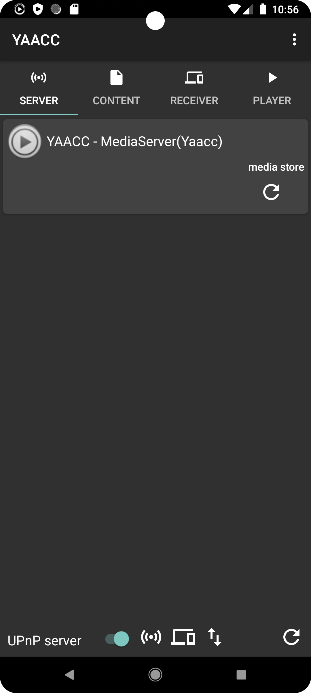
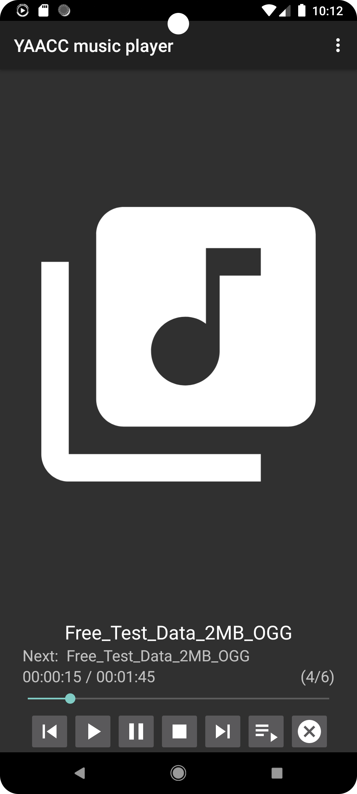
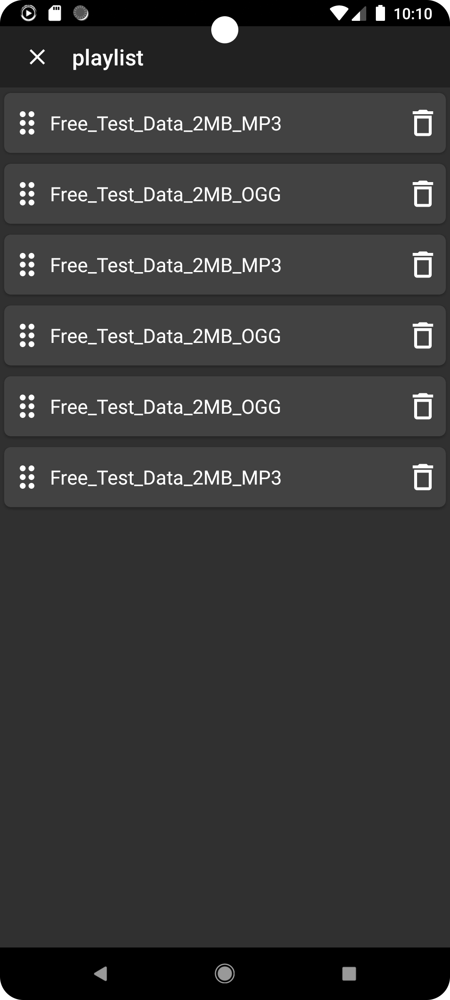

# YAACC - UPNP Client and Server

## About YAACC

YAACC (Yet Another Android Client Controller) is a hobby project I am working on in my free time. So
it's not perfect and I am only able to test the app with my own hardware setup.

Please, help improving YAACC by reporting problems or sending pull requests.

Have fun!

tobexyz

[](https://f-droid.org/packages/de.yaacc/)

  
  

## Description

The App allows you to play media from UPnP/DLNA devices in your network on your android device or
any capable UPnP device in your network. It is also possible to start an UPnP server on your device
in order to play media from your device on any UPnP renderer in your network.

## Features

* UPnP/DLNA Server - share files of your device in the network
* UPnP/DLNA Client - receive media from other devices on your device
* UPnP/DLNA Controller - control media renderer in the network
* Control multiple media renderer
* Allow download files to the device
* Allow sharing of URLs and sending them to the current media renderers
* Use your device as an proxy if your media renderer can't process https media URLs

## Configuration

Please take a look in the settings of the app. A lot of configuration can be done there.

The media server is stopped by default and has to be activated in the settings.
For this go to settings and tick some checkboxes under "Local server configuration" depending
on your configuration needs. You can start the server by activating the corresponding setting
or by activating the switch at the bottom of the server tab

## A word about the cling library

This project is based on the work of <https://github.com/4thline/cling>. This great UPnP library
made
yaacc possible and all honor belongs to the authors of that project. Thank you for your work on that
project!

Unfortunately the project went into the EOL state and no maintainer is found yet. Therefore a copy
of the parts of cling needed by YAACC are now included in this repository because I am not able to
maintain the whole project.

## Build dependencies

Android SDK (set ANDROID_HOME or create a local.properties file to point to it)

## Build from source

Build the project by running following command in the project root:

```./gradlew build```

After the build has finished the debug apk is located in
```./yaacc/build/outputs/apk/debug/yaacc-debug.apk```

## Documentation

<https://tobexyz.github.io/yaacc-code>
