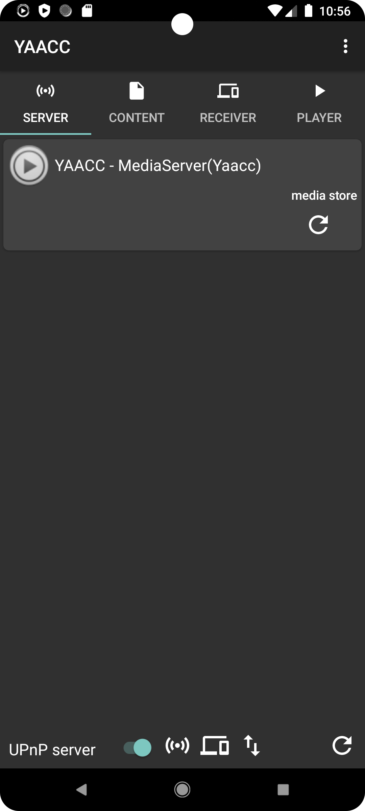
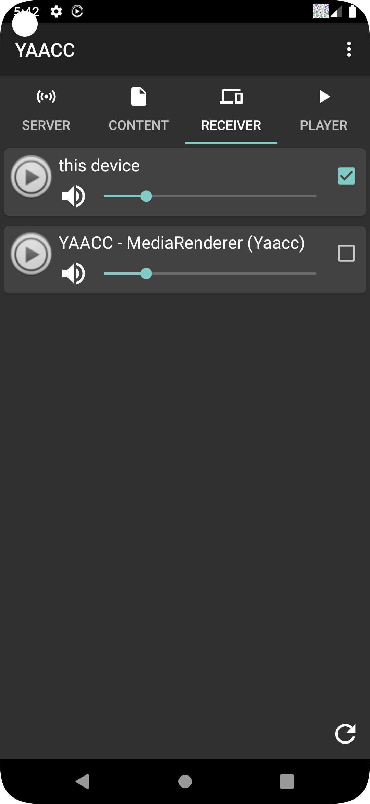
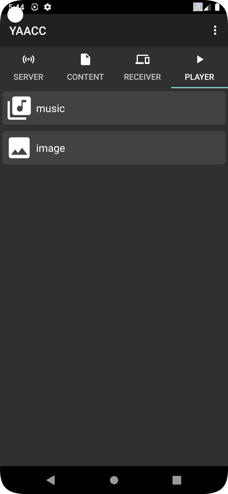
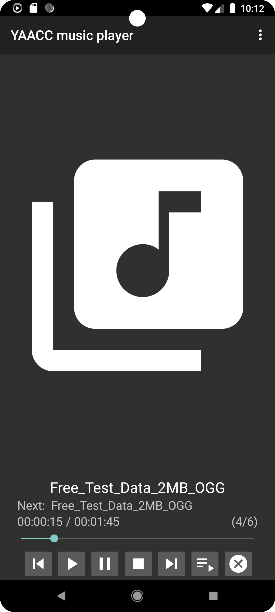

<!-- markdownlint-configure-file {
    "first-line-h1": false
} -->

* TOC {:toc}

# Features

* UPnP/DLNA Server - share files of your device in the network
* UPnP/DLNA Client - receive media from other devices on your device
* UPnP/DLNA Controller - control media renderer in the network
* Control multiple media renderer
* Allow download files to the device
* Allow sharing of URLs and sending them to the current media renderers
* Use your device as an proxy if your media renderer can't process https media URLs

# Usage

On the first screen all UPnP/DLNA servers in your network are listed.
Select one and the app will automatically switch to the content tab.
It allows to browse the content provided by the selected server.

{:height="30%" width="30%"}

Before selecting content make sure you have chosen an receiver on
the receiver tab. Receivers are either UPnP/DLNA media renderers in
your network or the android device itself.

{:height="30%" width="30%"}

Normally senders and receivers will appear automatically.
If not you can use the refresh button at the bottom of
the sender and receiver tab to trigger a new search for devices.

## Content browsing

The content browsing has a bread crumb on the top.
Behind each content entry different symbols are showing the possible actions:

* add an item to the playlist
* download the item
* play the item
* play all items on the same directory level

At the bottom of the screen the currently selected sender and receiver is displayed.

{:height="30%" width="30%"}

## Playing content

YAACC is able to control an multiple players at the same time.
For example you are able to stream a image show with background music
on your device, starting a movie on a TV or play music on a
smart speaker at the same time.

Each player is displayed in the player tab. Depending on the content type
and if the content is played by YAACC itself or a network device, the player ui differs.

{:height="30%" width="30%"}

YAACC includes a player for music and image shows.
Videos are played using a third parties app on the device.
The video app will start automatically, if video content is selected for playing

{:height="30%" width="30%"}

{:height="30%" width="30%"}

## Media server

YAACC includes a media server service, which has to be enabled separately.
A switch for this is located at the bottom of the server list tab.

{:height="30%" width="30%"}

Depending on the configurations for the server in the settings,
the server service is used as media provider, media renderer or proxy.
The icons behind the server switch are showing which service is activated.

## Media provider

If the device is used as media provider, media files stored on the device
are accessible for other UPnP/DLNA devices in you network.
At the moment there are no restrictions beside the content type,
which files are accessible and which are not.
Be aware of this when activating the service!

## Media renderer

This service allows your device acting as an media renderer. Therefore the
device can be controlled by other UPnP/DLNA controllers in your network
and receive and play media from UPnP/DLNA servers.

## Media proxy

The proxy service is used in the context of sharing URLs with YAACC and
playing the URL on a UPnP/DLNA device in your network. Normally the
URL will directly passed to the rendering device. Sometimes the rendering
device is not able to play https URLs. Therefore we need to get rid of the
encryption and provide the content with an unencrypted http URL.
For this the proxy service can be used. In that case the URL shared with
YAACC will not directly passed to the rendering device. YAACC generates a
new http based URL which points to YAACC and send the to the receiver.
When the content is played YAACC fetches the data from the origin through the
encrypted https connection an passed the content unencrypted through the http
connection to the rendering device.

| [Screenshots](screenshots/) | [Settings](settings/) |  [About](about/) | [Code](doxygen/html/inherits.html)
