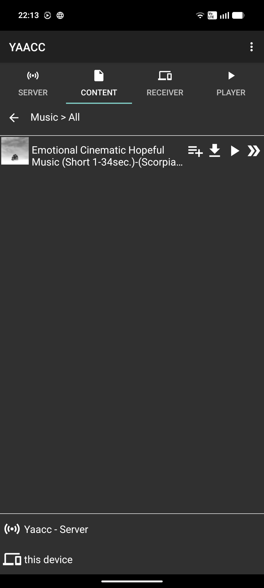
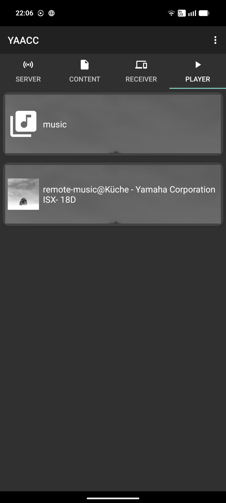
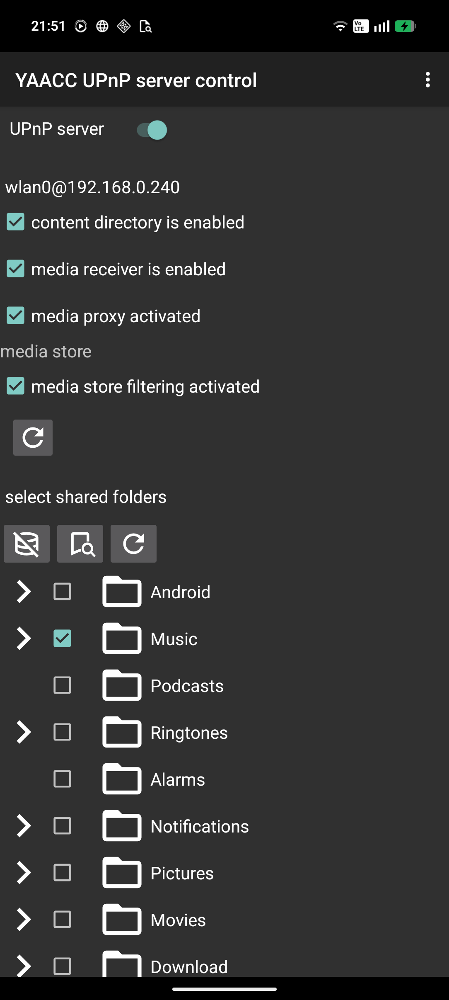
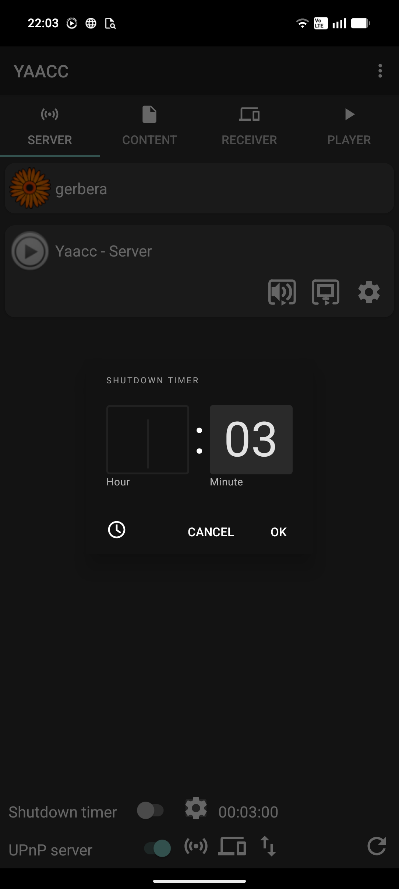

<!-- markdownlint-configure-file {
    "first-line-h1": false
} -->

* TOC
  {:toc}

# Features

* UPnP/DLNA Server - share files of your device in the network
* UPnP/DLNA Client - receive media from other devices on your device
* UPnP/DLNA Controller - control media renderer in the network
* Control multiple media renderer
* Allow download files to the device
* Allow sharing of URLs and sending them to the current media renderers
* Use your device as an proxy if your media renderer can't process https media URLs
* Download files to the device for offline access
* A Shutdown timer stops the running players and the app after a given time

# Usage

On the first screen all UPnP/DLNA servers in your network are listed.
Select one and the app will automatically switch to the content tab.
It allows to browse the content provided by the selected server.

{:height="30%" width="30%"}

Before selecting content make sure you have chosen an receiver on
the receiver tab. Receivers are either UPnP/DLNA media renderers in
your network or the android device itself.

{:height="30%" width="30%"}

Normally senders and receivers will appear automatically.
If not you can use the refresh button at the bottom of
the sender and receiver tab to trigger a new search for devices.

## Content browsing

The content browsing has a bread crumb on the top.
Behind each content entry different symbols are showing the possible actions:

* add an item to the playlist
* download the item
* play the item
* play all items on the same directory level

At the bottom of the screen the currently selected sender and receiver is displayed.

{:height="30%" width="30%"}

## Playing content

YAACC is able to control multiple players at the same time.
For example you are able to stream an image show with background music
on your device, starting a movie on a TV or play music on a
smart speaker at the same time.

Each player is displayed in the player tab. Depending on the content type
and if the content is played by YAACC itself or a network device, the player ui differs.

{:height="30%" width="30%"}

YAACC includes a player for music and image shows.
Videos are played using a third parties app on the device.
The video app will start automatically, if video content is selected for playing

{:height="30%" width="30%"}

{:height="30%" width="30%"}

### Receiver controls

The receiver tab shows all available UPnP/DLNA renderers in your network, including your device.
Each renderer displays:

* Current playback status (PLAYING badge when active)
* Track title and album art (when available)
* Play/pause/stop controls
* Volume control
* Mute button

{:height="30%" width="30%"}

You can control playback directly from the receiver tab without opening the player view.
The controls work for both local playback and remote UPnP devices.

### Lock screen controls

When playing media locally, YAACC provides lock screen controls:

* Play/pause/stop buttons
* Next/previous track
* Track metadata display
* Album art
* Hardware volume buttons control playback volume

## Live streaming (Android 10+)

YAACC can stream your device's screen and system audio to UPnP/DLNA renderers in your network.

### System audio streaming

Stream all audio playing on your device to network speakers or receivers:

* Captures system audio (music, podcasts, games, etc.)
* 44.1kHz stereo, high quality
* Works with most UPnP audio renderers
* Multiple simultaneous clients supported

**Note:** Some apps may block audio capture (DRM-protected content like Spotify, YouTube Premium).

### Screen casting

Stream your device's screen to TVs or displays:

* 720p video at 15fps
* MJPEG format for broad compatibility
* Works in web browsers and some UPnP video players
* Useful for presentations and screen sharing

### Enabling live streaming

1. Go to the Server tab
2. Find your local device in the list
3. Tap the audio or video button
4. Grant MediaProjection permission when prompted
5. The stream appears in the "Live Streams" folder

Access streams via UPnP or directly:
* Audio: `http://<device-ip>:49157/live/audio`
* Video: `http://<device-ip>:49157/live/video`

## Storage Access Framework (SAF)

YAACC supports browsing files from external storage, USB drives, and SD cards using Android's
Storage Access Framework. This allows sharing media from any storage location accessible on your device.

### Configuring SAF folders

In the server control view, you can add SAF folders to share:

1. Tap "Add SAF folder"
2. Select the folder using Android's file picker
3. Grant permission when prompted
4. The folder appears in the server content directory

{:height="30%" width="30%"}

### Performance optimization

YAACC caches metadata (duration, MIME type, file size) for faster browsing:

* First browse: Extracts metadata from files
* Subsequent browses: Uses cached data
* Cache persists across app restarts
* Clear cache button available in server control view

The cache significantly improves browsing performance, especially for large media collections.

## Battery optimization

YAACC includes several battery-saving features:

### Smart WiFi lock management

The WiFi lock is only held when actually needed:

* Released when app is backgrounded (if server/renderer disabled)
* Released when no active streaming
* Automatically re-acquired when needed

### Smart foreground service

The player service intelligently manages foreground state:

* Foreground only when actively playing media
* Stops foreground when paused (notification hidden)
* Service stops completely when no players active

## Modern architecture

YAACC uses modern Android APIs for better performance and system integration:

* **Media3/ExoPlayer** - Modern media playback engine (replaces deprecated MediaPlayer)
* **MediaSession** - System-wide media controls and lock screen integration
* **Improved UPnP stack** - Enhanced reliability and network state handling
* **AudioPlaybackCapture** - System audio streaming (Android 10+)
* **MediaProjection** - Screen casting support

## Media server

YAACC includes a media server service, which has to be enabled separately.
A switch for this is located at the bottom of the server list tab.

{:height="30%" width="30%"}

Depending on the configurations for the server in the settings,
the server service is used as media provider, media renderer or proxy.
The icons behind the server switch are showing which service is activated.

## Media provider

If the device is used as media provider, media files stored on the device
are accessible for other UPnP/DLNA devices in you network.

The shareable folders have to be configured using the server control view.
All included files and folders are accessible for other devices in your network.

{:height="30%" width="30%"}

The server control view is accessible through the YAACC entry in the server list tab or
the YAACC server service notification.

## Media renderer

This service allows your device acting as an media renderer. Therefore the
device can be controlled by other UPnP/DLNA controllers in your network
and receive and play media from UPnP/DLNA servers.

## Media proxy

The proxy service is used in the context of sharing URLs with YAACC and
playing the URL on a UPnP/DLNA device in your network. Normally the
URL will directly passed to the rendering device. Sometimes the rendering
device is not able to play https URLs. Therefore we need to get rid of the
encryption and provide the content with an unencrypted http URL.
For this the proxy service can be used. In that case the URL shared with
YAACC will not directly passed to the rendering device. YAACC generates a
new http based URL which points to YAACC and send the to the receiver.
When the content is played YAACC fetches the data from the origin through the
encrypted https connection an passed the content unencrypted through the http
connection to the rendering device.

## Shutdown timer

The shutdown timer stops all running players and the app after a certain time.
The timer is settable and can be enabled at the bottom of the server list tab and the remaining time
is displayed.

{:height="30%" width="30%"}

{:height="30%" width="30%"}

| [Screenshots](screenshots/) | [Settings](settings/) |  [About](about/) | [Code](doxygen/html/inherits.html)

