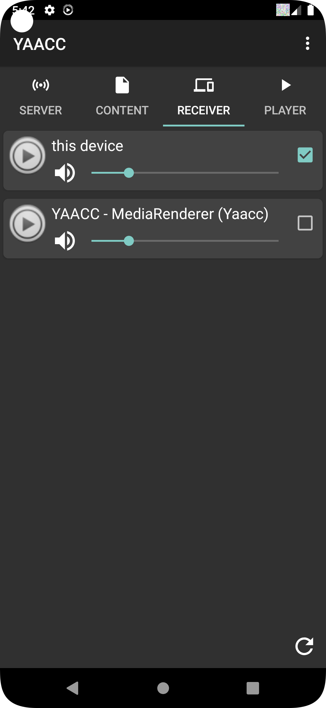

[Up]({{site.baseurl}}/)

# Screenshots of YAACC

- [Version 4.x.x](#4.x.x)
- [Version 3.x.x](#3.x.x)
- [Version 2.x.x](#2.x.x)

## Version 4.1.x

{:height="30%" width="30%"}
{:height="30%" width="30%"}
{:height="30%" width="30%"}
{:height="30%" width="30%"}
{:height="30%" width="30%"}
{:height="30%" width="30%"}
{:height="30%" width="30%"}
{:height="30%" width="30%"}
{:height="30%" width="30%"}

## Version 4.0.x

{:height="30%" width="30%"}
{:height="30%" width="30%"}
{:height="30%" width="30%"}
{:height="30%" width="30%"}
{:height="30%" width="30%"}
{:height="30%" width="30%"}
{:height="30%" width="30%"}
{:height="30%" width="30%"}
{:height="30%" width="30%"}

## Version 3.x.x

{:height="30%" width="30%"}
{:height="30%" width="30%"}
{:height="30%" width="30%"}
{:height="30%" width="30%"}
{:height="30%" width="30%"}
{:height="30%" width="30%"}
{:height="30%" width="30%"}
{:height="30%" width="30%"}
{:height="30%" width="30%"}

## up to version 2.x.x

{:height="30%" width="30%"}
{:height="30%" width="30%"}
{:height="30%" width="30%"}
{:height="30%" width="30%"}
{:height="30%" width="30%"}
{:height="30%" width="30%"}
{:height="30%" width="30%"}
{:height="30%" width="30%"}
{:height="30%" width="30%"}
